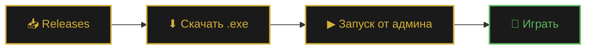
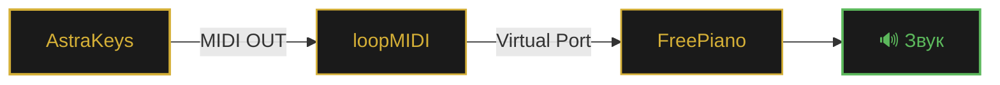

<div align="center">


<br>

### ✨ Играйте · Записывайте · Редактируйте · Экспортируйте ✨

<br>

<a href="https://github.com/SMisha2/AstraKeys/releases/latest">
  
</a>
<a href="#-документация">
  
</a>
<a href="https://github.com/SMisha2/AstraKeys/issues">
  
</a>
<a href="https://github.com/SMisha2/AstraKeys/stargazers">
  
</a>

<br><br>

<sub>


</sub>

</div>

<br>

---

<br>

<div align="center">

## 📸 Скриншоты

</div>

<div align="center">

<table>
<tr>
<td align="center" width="50%">

<br><br>
<b>🎹 Главное окно</b>
<br>
<sub>Плейлист, плеер и настройки</sub>
</td>
<td align="center" width="50%">

<br><br>
<b>🎼 Оверлей нот</b>
<br>
<sub>Ноты поверх игры в реальном времени</sub>
</td>
</tr>
<tr>
<td align="center" width="50%">

<br><br>
<b>✂️ Редактор записей</b>
<br>
<sub>Обрезка, склейка, квантизация</sub>
</td>
<td align="center" width="50%">

<br><br>
<b>📚 Менеджер записей</b>
<br>
<sub>Поиск, избранное, экспорт</sub>
</td>
</tr>
</table>

<sub><i>Скриншоты можно найти в папке <code>docs/</code></i></sub>

</div>

<br>

---

<br>

<div align="center">

## 🎯 Что это

</div>

**AstraKeys** — приложение для Windows, которое играет музыку в Roblox за вас. Вставляете текст песни в формате Roblox-пианино — программа эмулирует нажатия клавиш с точными таймингами.

Помимо воспроизведения — **полноценная студия**: записывает вашу игру, редактирует записи, экспортирует в MIDI и умеет отправлять ноты на внешние синтезаторы через loopMIDI.

<br>

<details>
<summary><b>📑 Содержание</b> <i>(нажмите, чтобы развернуть)</i></summary>

<br>

- [Возможности](#-возможности)
- [Установка](#-установка)
- [Горячие клавиши](#-горячие-клавиши)
- [Формат песен](#-формат-песен)
- [MIDI (FreePiano)](#-midi-freepiano)
- [Файлы настроек](#-файлы-настроек)
- [FAQ](#-faq)
- [Стек](#-стек)
- [Вклад](#-вклад)
- [Лицензия](#-лицензия)

</details>

<br>

---

<br>

<div align="center">

## 🌟 Возможности

</div>

<table>
<tr>
<td width="50%" valign="top">

### 🎵 Воспроизведение

- 📜 Плейлист с drag & drop
- 🎹 Аккорды в формате Roblox
- ⏱️ Точная эмуляция нажатий
- 🎯 Два режима: **без задержек** / **с человеческими задержками**
- 🎚️ Скорость **0.5× – 2.0×**
- 🎼 Поддержка **BPM** для авто-удержания

### 📝 Запись и редактор

- 🔴 Запись в реальном времени `F12`
- ✂️ Обрезка записей
- 🔗 Склейка двух записей
- ↩️ Undo / Redo
- 🎯 Квантизация `1/4` `1/8` `1/16` `1/32`
- ⭐ Избранное, поиск, сортировка
- 📦 Импорт / экспорт ZIP

</td>
<td width="50%" valign="top">

### 🎼 MIDI & Audio

- 🎹 MIDI-выход для FreePiano / loopMIDI
- 💾 Экспорт в `.mid`
- 🔊 Локальный звук через динамики *(ADSR-синтез)*
- 🎚️ Регулировка громкости
- 🎹 Воспроизведение **без педали** *(auto-hold)*

### 🎨 Интерфейс

- 🌗 **10 тем** + кастомная
- ✨ Плавные анимации
- 🌍 Локализация **RU / EN / UK**
- 🪟 Оверлей поверх игры
- 📊 История воспроизведений
- 🔄 Авто-обновления с GitHub

</td>
</tr>
</table>

<br>

---

<br>

<div align="center">

## 🚀 Установка

</div>

### ⚡ Готовый `.exe` *(рекомендуется)*



1. Откройте [**Releases**](https://github.com/SMisha2/AstraKeys/releases/latest)
2. Скачайте `AstraKeys.exe`
3. Запустите **от имени администратора**

<br>

> [!WARNING]
> **Антивирус может ругаться** — это ложное срабатывание PyInstaller.
> Добавьте файл в исключения: *Windows Defender → Защита от вирусов → Исключения*.

<br>

### 🐍 Из исходников

```bash
# 1. Клонируйте репозиторий
git clone https://github.com/SMisha2/AstraKeys.git
cd AstraKeys

# 2. Установите зависимости
pip install PyQt6 requests
pip install mido python-rtmidi midiutil pynput
pip install sounddevice numpy pywin32

# 3. Запустите
python AstraKeys.py
```

<br>

<details>
<summary><b>🛠️ Сборка .exe через PyInstaller</b></summary>

<br>

```bash
pip install pyinstaller

pyinstaller --noconfirm --clean --onefile --windowed ^
    --name "AstraKeys" ^
    --icon "assets/icon.ico" ^
    --hidden-import pynput.keyboard._win32 ^
    --hidden-import pynput.mouse._win32 ^
    --hidden-import sounddevice ^
    --hidden-import mido.backends.rtmidi ^
    --hidden-import win32gui ^
    --hidden-import win32con ^
    --collect-binaries sounddevice ^
    --collect-binaries rtmidi ^
    --collect-submodules pynput ^
    --collect-data midiutil ^
    AstraKeys.py
```

Готовый файл появится в `dist/AstraKeys.exe`.

</details>

<br>

---

<br>

<div align="center">

## 🎮 Горячие клавиши

</div>

<div align="center">

| | | | |
|:---:|:---|:---:|:---|
| <kbd>F1</kbd> | ▶ Пуск / Пауза | <kbd>F7</kbd> | 🔀 Сменить режим |
| <kbd>F2</kbd> | 🔄 Рестарт песни | <kbd>F8</kbd> | ⏭ Следующая песня |
| <kbd>F3</kbd> | ⏩ +25 нот | <kbd>F9</kbd> | ⏹ Стоп воспроизведения |
| <kbd>F4</kbd> | ⏪ −25 нот | <kbd>F10</kbd> | 🎵 Последняя запись |
| <kbd>F5</kbd> | ⏸ Пауза записи | <kbd>F12</kbd> | 🔴 Начать / стоп запись |
| <kbd>F6</kbd> | ❄ Заморозка позиции | <kbd>Ctrl</kbd>+<kbd>↑↓</kbd> | ⚡ Скорость ± |

</div>

> 💡 **Символы педалей:** `-` `=` `[` `]` — удерживают ноту, пока зажаты

<br>

---

<br>

<div align="center">

## 🎼 Формат песен

</div>

Стандартная нотная запись Roblox:

```text
[eT] [eT] [6eT] [ey] [6eT] [4qe] [qe] [6qe] [qE] 4 [6qe] 6 [QPS] C [Sc]
```

### 📖 Синтаксис

| Символ | Значение |
|:---:|:---|
| `q` | Нота — строчная (белая клавиша) |
| `Q` | Нота — заглавная (чёрная клавиша) |
| `[qwe]` | Аккорд — ноты играются одновременно |
| `-` `=` `[` `]` | Педаль — удержание ноты |
| _пробел_ | Игнорируется |

### 🎹 Карта клавиш

```text
1 2 3 4 5 6 7 8 9 0   →   C D E F G A B C D E
q w e r t y u i o p   →   F G A B C D E F G A
a s d f g h j k l     →   B C D E F G A B C
z x c v b n m         →   D E F G A B C
```

> 🔥 Заглавные буквы и символы `!@#$%^&*()` — **диезы** (чёрные клавиши)

<br>

### ⏱ Timed-формат *(с версии 1.3.0)*

Формат с абсолютными таймингами для точного воспроизведения:

```text
C {1441ms release}   I   [Q I] {214842ms press}
```

| Часть | Значение |
|:---|:---|
| `{NNNms press}` | Нота **нажимается** через N мс от начала |
| `{NNNms release}` | Нота **отпускается** через N мс от начала |
| _без `{}`_ | Интерполируется между ближайшими якорями |

<br>

---

<br>

<div align="center">

## 🎹 MIDI (FreePiano)

</div>



<br>

1. Установите [**loopMIDI**](https://www.tobias-erichsen.de/software/loopmidi.html)
2. Создайте виртуальный порт *(например, `AstraKeys`)*
3. В AstraKeys откройте вкладку **MIDI** → включите **MIDI-выход** → выберите порт → нажмите **Тест**
4. В FreePiano выберите этот же порт как вход

<br>

---

<br>

<div align="center">

## 📁 Файлы настроек

</div>

Всё хранится рядом с приложением в JSON-формате:

| 📄 Файл | 🗂 Содержимое |
|:---|:---|
| `app_settings.json` | Язык, тема, MIDI, задержки, скорость, BPM |
| `playlist.json` | Сохранённый плейлист |
| `pedal_settings.json` | Символы педалей |
| `recordings_index.json` | Индекс всех записей |
| `overlay_settings.json` | Настройки оверлея |
| `window_state.json` | Позиция и размер окна |
| `hotkeys.json` | Кастомные горячие клавиши |
| `play_history.json` | История воспроизведений |
| `song_profiles.json` | Профили песен |
| `draft.txt` | Автосохранение ввода |
| `recordings/` | Записи `.json` + `.mid` |
| `backups/` | Автобэкапы плейлиста |

<br>

---

<br>

<div align="center">

## ❓ FAQ

</div>

<details>
<summary><b>🛡 Антивирус удаляет AstraKeys.exe</b></summary>
<br>

Ложное срабатывание PyInstaller. Добавьте файл в исключения:

**Windows Defender → Защита от вирусов → Исключения → Добавить файл.**

</details>

<details>
<summary><b>⌨ Клавиши не нажимаются в Roblox</b></summary>
<br>

Запустите AstraKeys **от имени администратора**. Roblox и автокликер должны иметь одинаковые права доступа.

</details>

<details>
<summary><b>🎹 MIDI-порт не появляется</b></summary>
<br>

Установите loopMIDI и создайте порт **до запуска** AstraKeys. Затем нажмите **⟳** во вкладке MIDI для обновления списка.

</details>

<details>
<summary><b>🔊 Нет звука в динамиках</b></summary>
<br>

```bash
pip install sounddevice numpy
```

Затем включите галочку **«Звук в динамиках»** во вкладке «Параметры».

</details>

<details>
<summary><b>⏱ Запись получилась кривой по таймингам</b></summary>
<br>

Откройте **Редактор → Обрезка** в менеджере записей. Точность также зависит от режима:

- 🎯 **«Без задержек»** — детерминированный
- 🎲 **«С задержками»** — рандомизированный

</details>

<details>
<summary><b>🎮 Можно ли использовать с другими играми?</b></summary>
<br>

Да — любая игра, где ноты играются клавишами `1234567890 qwerty...`. Убедитесь, что окно игры в фокусе.

</details>

<br>

---

<br>

<div align="center">

## 🛠 Стек

<br>

<p>


</p>

</div>

<br>

---

<br>

<div align="center">

## 📊 Статистика

<br>


<br><br>

<a href="https://star-history.com/#SMisha2/AstraKeys&Date">
  
</a>

</div>

<br>

---

<br>

<div align="center">

## 🤝 Вклад

</div>

**Pull requests приветствуются!** 🎉
По крупным изменениям сначала откройте [issue](https://github.com/SMisha2/AstraKeys/issues) для обсуждения.

```bash
# Fork → Branch → PR
git checkout -b feature/amazing-feature
git commit -m "feat: add amazing feature"
git push origin feature/amazing-feature
```

<br>

<div align="center">

| 🐛 [Report Bug](https://github.com/SMisha2/AstraKeys/issues/new) · 💡 [Request Feature](https://github.com/SMisha2/AstraKeys/issues/new) · ⭐ [Star](https://github.com/SMisha2/AstraKeys/stargazers) |
|:---:|

</div>

<br>

---

<br>

<div align="center">

## ⚠️ Дисклеймер

</div>

> AstraKeys — инструмент для обучения и развлечения.
> Автоматизация может нарушать правила использования Roblox и других игр.
> Автор **не несёт ответственности** за блокировку аккаунтов или другие последствия.
> Используйте на свой страх и риск — предпочтительно в одиночных режимах и личных проектах.

<br>

---

<br>

<div align="center">

## 📜 Лицензия

Проект распространяется под лицензией **MIT** — используйте, форкайте, модифицируйте свободно.


</div>

<br>


<div align="center">

<br>

<sub>
<b>Автор:</b> <a href="https://github.com/SMisha2">SMisha2</a>
&nbsp;·&nbsp;
<b>Версия:</b> <code>1.3.0</code>
&nbsp;·&nbsp;
<b>Обновлено:</b> 2026
</sub>

<br><br>

<a href="https://github.com/SMisha2/AstraKeys/stargazers">
  
</a>

<br><br>

<sub>⬆ <a href="#top">Наверх</a></sub>

</div>
