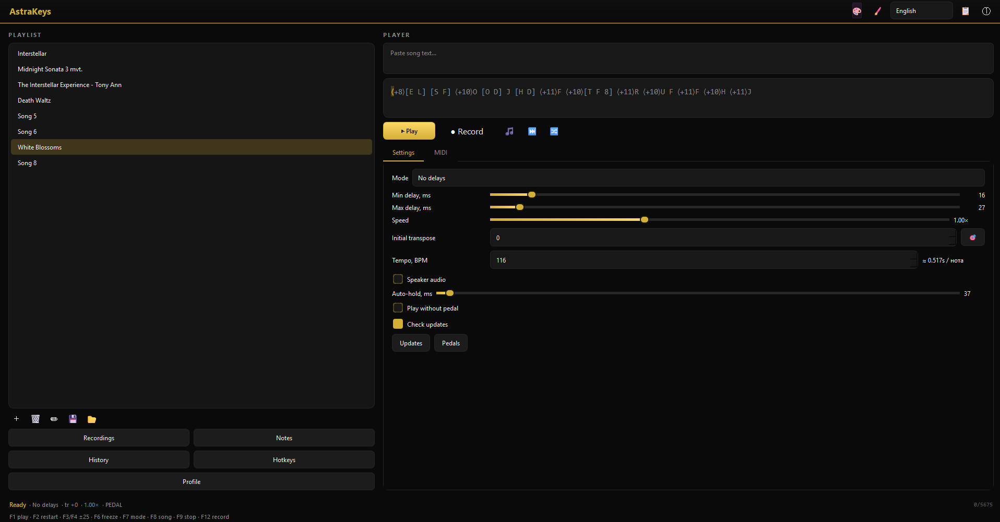
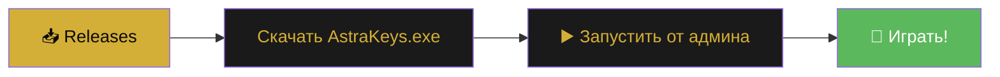
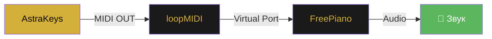

```markdown
<div align="center">


<p>
  
  
  
  
</p>

<p>
  
  
  
  
</p>

<h3>
  ✨ Играйте · Записывайте · Редактируйте · Экспортируйте ✨<br>
  <sub>Всё в одном приложении с золотым интерфейсом</sub>
</h3>

<p>
  <a href="https://github.com/SMisha2/AstraKeys/releases/latest">
    
  </a>
  <a href="#-документация">
    
  </a>
  <a href="https://github.com/SMisha2/AstraKeys/issues">
    
  </a>
</p>

</div>

---

<div align="center">

## 📸 Скриншоты

</div>

<div align="center">

| 🎹 Главное окно | 🎼 Оверлей нот |
|:---:|:---:|
|  |  |
| **✂️ Редактор записей** | **📚 Менеджер записей** |
|  |  |

</div>

---

<div align="center">

## 🌟 Возможности

</div>

<table align="center">
<tr>
<td width="50%" valign="top">

### 🎵 Воспроизведение

- 📜 **Плейлисты** с drag & drop
- 🎹 **Аккорды** и ноты в формате Roblox
- ⏱️ **Точная** эмуляция нажатий клавиш
- 🎯 Два режима: *без задержек* / *с человеческими задержками*
- 🎚️ Регулировка **скорости** (0.5× – 2.0×)
- 🎼 Поддержка **BPM** для авто-удержания нот

### 📝 Запись и редактор

- 🔴 **Запись** нажатий в реальном времени (F12)
- ✂️ **Обрезка** записей (trim)
- 🔗 **Склейка** двух записей с паузой
- ⭐ **Избранное**, поиск, сортировка
- 📦 **Импорт / экспорт** ZIP-архивов
- ↩️ **Undo / Redo** в редакторе
- 🎯 **Квантизация** по сетке (1/4, 1/8, 1/16, 1/32)

</td>
<td width="50%" valign="top">

### 🎼 MIDI & Audio

- 🎹 **MIDI-выход** для FreePiano / loopMIDI
- 💾 Экспорт в `.mid` файлы
- 🔊 Локальный звук через динамики (**ADSR-синтез**)
- 🎚️ Регулировка громкости и авто-удержания
- 🎹 Воспроизведение **без педали** (auto-hold)

### 🎨 Интерфейс

- 🌗 **10 тем**: Золото, Песок, Синий, Фиолетовый, Зелёный, Розовый, Красный, Голубой, Оранжевый, Моно
- 🖌️ **Своя цветовая схема** (custom theme)
- ✨ **Плавные анимации** перехода темы
- 🌍 Полная локализация: 🇷🇺 RU / 🇬🇧 EN / 🇺🇦 UK
- 🪟 **Оверлей нот** поверх Roblox
- 📊 **История** воспроизведений
- 🔄 **Авто-обновления** с GitHub

</td>
</tr>
</table>

---

<div align="center">

## 🚀 Установка

</div>

### ⚡ Вариант 1: Готовый `.exe` *(рекомендуется)*



1. Перейдите в раздел **[Releases](https://github.com/SMisha2/AstraKeys/releases/latest)**
2. Скачайте последний **`AstraKeys.exe`**
3. Запустите **от имени администратора** *(нужно для эмуляции клавиатуры)*

> [!WARNING]
> 🛡️ **Антивирус может ругаться** — это ложное срабатывание PyInstaller.
> Добавьте файл в исключения Windows Defender → «Защита от вирусов» → «Исключения».

### 🐍 Вариант 2: Из исходников

```bash
# 1️⃣ Клонируйте репозиторий
git clone https://github.com/SMisha2/AstraKeys.git
cd AstraKeys

# 2️⃣ Установите зависимости
pip install PyQt6 requests
pip install mido python-rtmidi midiutil pynput
pip install sounddevice numpy pywin32

# 3️⃣ Запустите
python AstraKeys.py
```

<details>
<summary><b>🛠️ Сборка .exe через PyInstaller</b> <i>(нажмите, чтобы развернуть)</i></summary>

<br>

```bash
pip install pyinstaller

pyinstaller --noconfirm --clean --onefile --windowed ^
    --name "AstraKeys" ^
    --icon "assets/icon.ico" ^
    --hidden-import pynput.keyboard._win32 ^
    --hidden-import pynput.mouse._win32 ^
    --hidden-import sounddevice ^
    --hidden-import mido.backends.rtmidi ^
    --hidden-import win32gui ^
    --hidden-import win32con ^
    --collect-binaries sounddevice ^
    --collect-binaries rtmidi ^
    --collect-submodules pynput ^
    --collect-data midiutil ^
    AstraKeys.py
```

Готовый файл появится в `dist/AstraKeys.exe`.

</details>

---

<div align="center">

## 🎮 Горячие клавиши

</div>

<div align="center">

| Клавиша | Действие | Клавиша | Действие |
|:---:|:---|:---:|:---|
| <kbd>F1</kbd> | ▶️ Пуск / Пауза | <kbd>F7</kbd> | 🔀 Сменить режим |
| <kbd>F2</kbd> | 🔄 Рестарт песни | <kbd>F8</kbd> | ⏭️ Следующая песня |
| <kbd>F3</kbd> | ⏩ +25 нот | <kbd>F9</kbd> | ⏹️ Стоп воспроизведения |
| <kbd>F4</kbd> | ⏪ −25 нот | <kbd>F10</kbd> | 🎵 Последняя запись |
| <kbd>F5</kbd> | ⏸️ Пауза записи | <kbd>F12</kbd> | 🔴 Начать / стоп запись |
| <kbd>F6</kbd> | ❄️ Заморозка позиции | <kbd>Ctrl</kbd>+<kbd>↑</kbd>/<kbd>↓</kbd> | ⚡ Скорость ± |

</div>

> 💡 **Символы педалей:** `-` `=` `[` `]` — удерживают ноту, пока зажаты

---

<div align="center">

## 🎼 Формат песен

</div>

AstraKeys использует **нотную запись Roblox**. Просто вставьте текст в поле ввода:

```text
[eT] [eT] [6eT] [ey] [6eT] [4qe] [qe] [6qe] [qE] 4 [6qe] 6 [QPS] C [Sc]
```

### 📖 Синтаксис

| Синтаксис | Значение |
|:---:|:---|
| `q` | Одиночная нота *(строчная = белая клавиша)* |
| `Q` | Одиночная нота *(заглавная = чёрная клавиша)* |
| `[qwe]` | **Аккорд** *(ноты играются одновременно)* |
| `-` `=` `[` `]` | **Педаль** *(удержание)* |
| `␣` *(пробел)* | Игнорируется |

### 🎹 Карта клавиш

```text
1 2 3 4 5 6 7 8 9 0   →   C D E F G A B C D E
q w e r t y u i o p   →   F G A B C D E F G A
a s d f g h j k l     →   B C D E F G A B C
z x c v b n m         →   D E F G A B C
```

> 🔥 Заглавные буквы и символы `!@#$%^&*()` — **диезы** (чёрные клавиши)

### ⏱️ Timed-формат *(v1.3.0+)*

Миксованный формат для точного воспроизведения с **абсолютными таймингами**:

```text
C {1441ms release}   I   [Q I] {214842ms press}
```

| Часть | Значение |
|:---|:---|
| `{NNNms press}` | Нота **нажимается** через N мс от начала |
| `{NNNms release}` | Нота **отпускается** через N мс от начала |
| Без `{}` | Интерполируется между ближайшими якорями |

---

<div align="center">

## 🎹 Настройка MIDI (FreePiano)

</div>



1. Установите **[loopMIDI](https://www.tobias-erichsen.de/software/loopmidi.html)**
2. Создайте виртуальный порт *(например, `AstraKeys`)*
3. В AstraKeys откройте вкладку **MIDI** → включите **«MIDI-выход»**
4. Выберите созданный порт → нажмите **«Тест»** *(играет C-мажор)*
5. В **FreePiano** выберите этот же порт как вход
6. 🎉 Готово! Ноты уходят в FreePiano параллельно с эмуляцией клавиатуры

---

<div align="center">

## 📁 Файлы настроек

</div>

Все настройки хранятся рядом с приложением в **JSON**-формате:

| 📄 Файл | 🗂️ Что хранит |
|:---|:---|
| `app_settings.json` | Язык, тема, MIDI, задержки, скорость, BPM |
| `playlist.json` | Сохранённый плейлист |
| `pedal_settings.json` | Символы педалей |
| `recordings_index.json` | Индекс всех записей |
| `overlay_settings.json` | Настройки оверлея нот |
| `window_state.json` | Позиция и размер окна |
| `hotkeys.json` | Пользовательские горячие клавиши |
| `play_history.json` | История воспроизведений |
| `song_profiles.json` | Профили песен *(индивидуальные настройки)* |
| `draft.txt` | Автосохранение ввода |
| `recordings/` | Записи `.json` + `.mid` |
| `backups/` | Автобэкапы плейлиста *(последние 20)* |

---

<div align="center">

## ❓ FAQ

</div>

<details>
<summary><b>🛡️ Антивирус удаляет AstraKeys.exe</b></summary>

<br>

Это **ложное срабатывание PyInstaller**. Добавьте файл в исключения:

**Windows Defender** → «Защита от вирусов и угроз» → «Исключения» → Добавить файл.

</details>

<details>
<summary><b>⌨️ Клавиши не нажимаются в Roblox</b></summary>

<br>

Запустите **AstraKeys от имени администратора**. Roblox и автокликер должны иметь одинаковые права доступа.

</details>

<details>
<summary><b>🎹 MIDI-порт не появляется</b></summary>

<br>

Установите **loopMIDI** и создайте порт **до запуска** AstraKeys. Если не помогло — нажмите **⟳** во вкладке MIDI для обновления списка.

</details>

<details>
<summary><b>🔊 Нет звука в динамиках</b></summary>

<br>

Установите аудио-зависимости:

```bash
pip install sounddevice numpy
```

Затем включите галочку **«Звук в динамиках»** во вкладке «Параметры».

</details>

<details>
<summary><b>⏱️ Запись получилась кривой по таймингам</b></summary>

<br>

В менеджере записей откройте **Редактор → Обрезка**. Точность воспроизведения также зависит от режима:

- 🎯 **«Без задержек»** — детерминированный
- 🎲 **«С задержками»** — рандомизированный *(человечнее)*

</details>

<details>
<summary><b>🎮 Можно ли использовать с другими играми?</b></summary>

<br>

**Да**, любая игра, где ноты играются клавишами `1234567890 qwerty...`.
Просто убедитесь, что окно игры находится **в фокусе**.

</details>

<details>
<summary><b>⏱️ Что такое timed-формат?</b></summary>

<br>

Новый формат из **v1.3.0**, позволяющий задавать **точные тайминги** в миллисекундах:

```text
C {1441ms release}   I   [Q I] {214842ms press}
```

Идеален для экспорта из MIDI-секвенсоров и воспроизведения сложных композиций с абсолютной точностью.

</details>

---

<div align="center">

## ⚠️ Дисклеймер

</div>

> **AstraKeys — это инструмент для обучения и развлечения.**
>
> Автоматизация может нарушать правила использования Roblox и других игр.
> Автор **не несёт ответственности** за блокировку аккаунтов или другие последствия.
>
> 🎮 **Используйте на свой страх и риск** — предпочтительно в одиночных режимах и личных проектах.

---

<div align="center">

## 🛠️ Технологии

<br>


<br>


</div>

---

<div align="center">

## 🤝 Вклад

</div>

**Pull requests приветствуются!** 🎉
По крупным изменениям сначала откройте [issue](https://github.com/SMisha2/AstraKeys/issues) для обсуждения.

```bash
# Fork → Branch → PR
git checkout -b feature/amazing-feature
git commit -m "feat: add amazing feature"
git push origin feature/amazing-feature
```

<div align="center">

| 🐛 [Report Bug](https://github.com/SMisha2/AstraKeys/issues/new) · 💡 [Request Feature](https://github.com/SMisha2/AstraKeys/issues/new) · ⭐ [Star](https://github.com/SMisha2/AstraKeys/stargazers) |
|:---:|

</div>

---

<div align="center">

## 📜 Лицензия

Проект распространяется под лицензией **MIT** — используйте, форкайте, модифицируйте свободно.


</div>

---

<div align="center">


### 💛 Сделано с любовью к музыке

**Автор:** [SMisha2](https://github.com/SMisha2)
**Версия:** `1.3.0` · **Обновлено:** 2026

<br>

<a href="https://github.com/SMisha2/AstraKeys/stargazers">
  
</a>

<br><br>

<sub>⬆️ <a href="#top">Наверх</a></sub>

</div>
```
