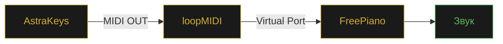

<div align="center">


<br>

<a href="https://github.com/SMisha2/AstraKeys/releases/latest">
  
</a>
<a href="https://github.com/SMisha2/AstraKeys/issues">
  
</a>
<a href="https://github.com/SMisha2/AstraKeys/stargazers">
  
</a>

<br><br>

<sub>


</sub>

</div>

<br>

---

<br>

## Что это

**AstraKeys** — это приложение для Windows, которое играет музыку в Roblox за вас. Вставляете текст песни в формате Roblox-пианино — программа эмулирует нажатия клавиш с точными таймингами.

Помимо воспроизведения — **полноценная студия**: записывает вашу игру, редактирует записи (обрезка, склейка, квантизация), экспортирует в MIDI и умеет отправлять ноты на внешние синтезаторы через loopMIDI.

<br>

---

<br>

## Возможности

**Воспроизведение**
Плейлист с drag & drop · аккорды · два режима (детерминированный / с человеческими задержками) · регулировка скорости 0.5×–2.0× · поддержка BPM

**Запись и редактор**
Запись в реальном времени (F12) · обрезка · склейка двух записей · undo/redo · квантизация по сетке · избранное и поиск · импорт/экспорт ZIP

**MIDI и звук**
MIDI-выход для FreePiano / loopMIDI · экспорт в `.mid` · локальный звук через динамики (ADSR-синтез) · воспроизведение без педали

**Интерфейс**
10 встроенных тем + кастомная · плавные анимации · локализация RU / EN / UK · оверлей нот поверх Roblox · история воспроизведений · авто-обновления

<br>

---

<br>

## Установка

### Готовый `.exe`

1. Откройте [**Releases**](https://github.com/SMisha2/AstraKeys/releases/latest)
2. Скачайте `AstraKeys.exe`
3. Запустите **от имени администратора**

> ⚠️ **Антивирус может ругаться** — это ложное срабатывание PyInstaller. Добавьте файл в исключения Windows Defender.

### Из исходников

```bash
git clone https://github.com/SMisha2/AstraKeys.git
cd AstraKeys

pip install PyQt6 requests
pip install mido python-rtmidi midiutil pynput
pip install sounddevice numpy pywin32

python AstraKeys.py
```

<details>
<summary>Сборка .exe через PyInstaller</summary>

<br>

```bash
pip install pyinstaller

pyinstaller --noconfirm --clean --onefile --windowed ^
    --name "AstraKeys" ^
    --icon "assets/icon.ico" ^
    --hidden-import pynput.keyboard._win32 ^
    --hidden-import pynput.mouse._win32 ^
    --hidden-import sounddevice ^
    --hidden-import mido.backends.rtmidi ^
    --hidden-import win32gui ^
    --hidden-import win32con ^
    --collect-binaries sounddevice ^
    --collect-binaries rtmidi ^
    --collect-submodules pynput ^
    --collect-data midiutil ^
    AstraKeys.py
```

</details>

<br>

---

<br>

## Горячие клавиши

| Клавиша | Действие | Клавиша | Действие |
|:---:|:---|:---:|:---|
| `F1` | Пуск / Пауза | `F7` | Сменить режим |
| `F2` | Рестарт песни | `F8` | Следующая песня |
| `F3` | +25 нот | `F9` | Стоп воспроизведения |
| `F4` | −25 нот | `F10` | Последняя запись |
| `F5` | Пауза записи | `F12` | Начать / стоп запись |
| `F6` | Заморозка позиции | `Ctrl ↑↓` | Скорость ± |

Символы педалей: `-` `=` `[` `]` — удерживают ноту, пока зажаты.

<br>

---

<br>

## Формат песен

Стандартная нотная запись Roblox:

```text
[eT] [eT] [6eT] [ey] [6eT] [4qe] [qe] [6qe] [qE] 4 [6qe] 6 [QPS] C [Sc]
```

| Синтаксис | Значение |
|:---:|:---|
| `q` | Нота (строчная — белая клавиша) |
| `Q` | Нота (заглавная — чёрная клавиша) |
| `[qwe]` | Аккорд — ноты играются одновременно |
| `-` `=` `[` `]` | Педаль — удержание ноты |
| _пробел_ | Игнорируется |

**Карта клавиш**

```text
1 2 3 4 5 6 7 8 9 0   →   C D E F G A B C D E
q w e r t y u i o p   →   F G A B C D E F G A
a s d f g h j k l     →   B C D E F G A B C
z x c v b n m         →   D E F G A B C
```

Заглавные буквы и символы `!@#$%^&*()` — диезы (чёрные клавиши).

### Timed-формат *(с версии 1.3.0)*

Формат с абсолютными таймингами для точного воспроизведения:

```text
C {1441ms release}   I   [Q I] {214842ms press}
```

| Часть | Значение |
|:---|:---|
| `{NNNms press}` | Нота нажимается через N мс от начала |
| `{NNNms release}` | Нота отпускается через N мс от начала |
| _без `{}`_ | Интерполируется между ближайшими якорями |

<br>

---

<br>

## MIDI (FreePiano)



1. Установите [loopMIDI](https://www.tobias-erichsen.de/software/loopmidi.html)
2. Создайте виртуальный порт (например, `AstraKeys`)
3. В AstraKeys откройте вкладку **MIDI**, включите **MIDI-выход**, выберите порт, нажмите **Тест**
4. В FreePiano выберите этот же порт как вход

<br>

---

<br>

## Файлы настроек

Всё хранится рядом с приложением в JSON:

| Файл | Содержимое |
|:---|:---|
| `app_settings.json` | Язык, тема, MIDI, задержки, скорость, BPM |
| `playlist.json` | Сохранённый плейлист |
| `pedal_settings.json` | Символы педалей |
| `recordings_index.json` | Индекс всех записей |
| `overlay_settings.json` | Настройки оверлея |
| `window_state.json` | Позиция и размер окна |
| `hotkeys.json` | Кастомные горячие клавиши |
| `play_history.json` | История воспроизведений |
| `song_profiles.json` | Профили песен |
| `draft.txt` | Автосохранение ввода |
| `recordings/` | Записи `.json` + `.mid` |
| `backups/` | Автобэкапы плейлиста |

<br>

---

<br>

## FAQ

<details>
<summary><b>Антивирус удаляет AstraKeys.exe</b></summary>
<br>
Ложное срабатывание PyInstaller. Добавьте файл в исключения: Windows Defender → «Защита от вирусов» → «Исключения».
</details>

<details>
<summary><b>Клавиши не нажимаются в Roblox</b></summary>
<br>
Запустите AstraKeys от имени администратора. Roblox и автокликер должны иметь одинаковые права.
</details>

<details>
<summary><b>MIDI-порт не появляется</b></summary>
<br>
Установите loopMIDI и создайте порт <i>до запуска</i> AstraKeys. Затем нажмите ⟳ во вкладке MIDI.
</details>

<details>
<summary><b>Нет звука в динамиках</b></summary>
<br>

```bash
pip install sounddevice numpy
```

Затем включите галочку «Звук в динамиках» во вкладке «Параметры».
</details>

<details>
<summary><b>Запись получилась кривой по таймингам</b></summary>
<br>
Откройте Редактор → Обрезка в менеджере записей. Точность также зависит от режима: «Без задержек» — детерминированный, «С задержками» — рандомизированный.
</details>

<details>
<summary><b>Можно ли использовать с другими играми?</b></summary>
<br>
Да, любая игра, где ноты играются клавишами <code>1234567890 qwerty...</code>. Убедитесь, что окно игры в фокусе.
</details>

<br>

---

<br>

## Дисклеймер

AstraKeys — инструмент для обучения и развлечения. Автоматизация может нарушать правила использования Roblox и других игр. Автор не несёт ответственности за блокировку аккаунтов или другие последствия. Используйте на свой страх и риск — предпочтительно в одиночных режимах и личных проектах.

<br>

---

<br>

## Стек

<p>


</p>

<br>

---

<br>

## Вклад

Pull requests приветствуются. По крупным изменениям сначала откройте [issue](https://github.com/SMisha2/AstraKeys/issues).

```bash
git checkout -b feature/amazing-feature
git commit -m "feat: add amazing feature"
git push origin feature/amazing-feature
```

<br>

---

<br>

## Лицензия

MIT — используйте, форкайте, модифицируйте свободно.

<br>

<div align="center">


<sub>Сделано с любовью к музыке · SMisha2 · 2026</sub>

</div>
