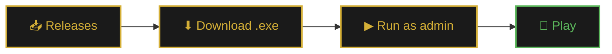
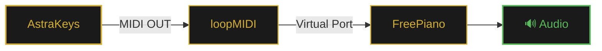

<div align="center">


<br>

### ✨ Play · Record · Edit · Export ✨

<br>

<a href="https://github.com/SMisha2/AstraKeys/releases/latest">
  
</a>
<a href="#-documentation">
  
</a>
<a href="https://github.com/SMisha2/AstraKeys/issues">
  
</a>
<a href="https://github.com/SMisha2/AstraKeys/stargazers">
  
</a>

<br><br>

<sub>


</sub>

</div>

<br>

---

<br>

<div align="center">

## 📸 Screenshots

</div>

<div align="center">

<table>
<tr>
<td align="center" width="50%">

<br><br>
<b>🎹 Main window</b>
<br>
<sub>Playlist, player, and settings</sub>
</td>
<td align="center" width="50%">

<br><br>
<b>🎼 Notes overlay</b>
<br>
<sub>Live notes on top of the game</sub>
</td>
</tr>
<tr>
<td align="center" width="50%">

<br><br>
<b>✂️ Recording editor</b>
<br>
<sub>Trim, concat, quantize</sub>
</td>
<td align="center" width="50%">

<br><br>
<b>📚 Recordings manager</b>
<br>
<sub>Search, favorites, export</sub>
</td>
</tr>
</table>

<sub><i>Screenshots live in the <code>docs/</code> folder</i></sub>

</div>

<br>

---

<br>

<div align="center">

## 🎯 What is it

</div>

**AstraKeys** is a Windows app that plays music in Roblox for you. Paste a song in Roblox piano notation — the program emulates key presses with precise timing.

Beyond playback, it's a **full studio**: records your playing, edits recordings, exports to MIDI, and can send notes to external synthesizers via loopMIDI.

<br>

<details>
<summary><b>📑 Table of Contents</b> <i>(click to expand)</i></summary>

<br>

- [Features](#-features)
- [Installation](#-installation)
- [Hotkeys](#-hotkeys)
- [Song format](#-song-format)
- [MIDI (FreePiano)](#-midi-freepiano)
- [Config files](#-config-files)
- [FAQ](#-faq)
- [Stack](#-stack)
- [Contributing](#-contributing)
- [License](#-license)

</details>

<br>

---

<br>

<div align="center">

## 🌟 Features

</div>

<table>
<tr>
<td width="50%" valign="top">

### 🎵 Playback

- 📜 Playlist with drag & drop
- 🎹 Chords in Roblox format
- ⏱️ Precise keypress emulation
- 🎯 Two modes: **no delays** / **human delays**
- 🎚️ Speed **0.5× – 2.0×**
- 🎼 **BPM** support for auto-hold

### 📝 Recording & Editor

- 🔴 Live recording `F12`
- ✂️ Trim recordings
- 🔗 Concatenate two recordings
- ↩️ Undo / Redo
- 🎯 Quantize `1/4` `1/8` `1/16` `1/32`
- ⭐ Favorites, search, sorting
- 📦 Import / export ZIP

</td>
<td width="50%" valign="top">

### 🎼 MIDI & Audio

- 🎹 MIDI output for FreePiano / loopMIDI
- 💾 Export to `.mid`
- 🔊 Local speaker audio *(ADSR synthesis)*
- 🎚️ Volume control
- 🎹 **Pedal-free** playback *(auto-hold)*

### 🎨 Interface

- 🌗 **10 themes** + custom
- ✨ Smooth animations
- 🌍 Localization **RU / EN / UK**
- 🪟 Overlay on top of the game
- 📊 Play history
- 🔄 Auto-updates from GitHub

</td>
</tr>
</table>

<br>

---

<br>

<div align="center">

## 🚀 Installation

</div>

### ⚡ Ready-to-use `.exe` *(recommended)*



1. Open [**Releases**](https://github.com/SMisha2/AstraKeys/releases/latest)
2. Download `AstraKeys.exe`
3. Run **as administrator**

<br>

> [!WARNING]
> **Your antivirus may complain** — this is a PyInstaller false positive.
> Add the file to exclusions: *Windows Defender → Virus & threat protection → Exclusions*.

<br>

### 🐍 From source

```bash
# 1. Clone the repository
git clone https://github.com/SMisha2/AstraKeys.git
cd AstraKeys

# 2. Install dependencies
pip install PyQt6 requests
pip install mido python-rtmidi midiutil pynput
pip install sounddevice numpy pywin32

# 3. Run
python AstraKeys.py
```

<br>

<details>
<summary><b>🛠️ Building .exe with PyInstaller</b></summary>

<br>

```bash
pip install pyinstaller

pyinstaller --noconfirm --clean --onefile --windowed ^
    --name "AstraKeys" ^
    --icon "assets/icon.ico" ^
    --hidden-import pynput.keyboard._win32 ^
    --hidden-import pynput.mouse._win32 ^
    --hidden-import sounddevice ^
    --hidden-import mido.backends.rtmidi ^
    --hidden-import win32gui ^
    --hidden-import win32con ^
    --collect-binaries sounddevice ^
    --collect-binaries rtmidi ^
    --collect-submodules pynput ^
    --collect-data midiutil ^
    AstraKeys.py
```

The resulting file will appear in `dist/AstraKeys.exe`.

</details>

<br>

---

<br>

<div align="center">

## 🎮 Hotkeys

</div>

<div align="center">

| | | | |
|:---:|:---|:---:|:---|
| <kbd>F1</kbd> | ▶ Play / Pause | <kbd>F7</kbd> | 🔀 Switch mode |
| <kbd>F2</kbd> | 🔄 Restart song | <kbd>F8</kbd> | ⏭ Next song |
| <kbd>F3</kbd> | ⏩ +25 notes | <kbd>F9</kbd> | ⏹ Stop playback |
| <kbd>F4</kbd> | ⏪ −25 notes | <kbd>F10</kbd> | 🎵 Last recording |
| <kbd>F5</kbd> | ⏸ Pause recording | <kbd>F12</kbd> | 🔴 Start / stop recording |
| <kbd>F6</kbd> | ❄ Freeze position | <kbd>Ctrl</kbd>+<kbd>↑↓</kbd> | ⚡ Speed ± |

</div>

> 💡 **Pedal keys:** `-` `=` `[` `]` — hold a note while pressed

<br>

---

<br>

<div align="center">

## 🎼 Song format

</div>

Standard Roblox piano notation:

```text
[eT] [eT] [6eT] [ey] [6eT] [4qe] [qe] [6qe] [qE] 4 [6qe] 6 [QPS] C [Sc]
```

### 📖 Syntax

| Symbol | Meaning |
|:---:|:---|
| `q` | Note — lowercase (white key) |
| `Q` | Note — uppercase (black key) |
| `[qwe]` | Chord — notes played simultaneously |
| `-` `=` `[` `]` | Pedal — note hold |
| _space_ | Ignored |

### 🎹 Key map

```text
1 2 3 4 5 6 7 8 9 0   →   C D E F G A B C D E
q w e r t y u i o p   →   F G A B C D E F G A
a s d f g h j k l     →   B C D E F G A B C
z x c v b n m         →   D E F G A B C
```

> 🔥 Uppercase letters and symbols `!@#$%^&*()` are **sharps** (black keys)

<br>

### ⏱ Timed format *(since v1.3.0)*

Format with absolute timings for precise playback:

```text
C {1441ms release}   I   [Q I] {214842ms press}
```

| Part | Meaning |
|:---|:---|
| `{NNNms press}` | Note **pressed** N ms after the start |
| `{NNNms release}` | Note **released** N ms after the start |
| _without `{}`_ | Interpolated between nearest anchors |

<br>

---

<br>

<div align="center">

## 🎹 MIDI (FreePiano)

</div>



<br>

1. Install [**loopMIDI**](https://www.tobias-erichsen.de/software/loopmidi.html)
2. Create a virtual port *(e.g., `AstraKeys`)*
3. In AstraKeys open the **MIDI** tab → enable **MIDI output** → select the port → click **Test**
4. In FreePiano select the same port as input

<br>

---

<br>

<div align="center">

## 📁 Config files

</div>

Everything is stored next to the app in JSON format:

| 📄 File | 🗂 Contents |
|:---|:---|
| `app_settings.json` | Language, theme, MIDI, delays, speed, BPM |
| `playlist.json` | Saved playlist |
| `pedal_settings.json` | Pedal characters |
| `recordings_index.json` | Index of all recordings |
| `overlay_settings.json` | Overlay settings |
| `window_state.json` | Window position and size |
| `hotkeys.json` | Custom hotkeys |
| `play_history.json` | Play history |
| `song_profiles.json` | Song profiles |
| `draft.txt` | Input autosave |
| `recordings/` | Recordings `.json` + `.mid` |
| `backups/` | Playlist backups |

<br>

---

<br>

<div align="center">

## ❓ FAQ

</div>

<details>
<summary><b>🛡 Antivirus deletes AstraKeys.exe</b></summary>
<br>

PyInstaller false positive. Add the file to exclusions:

**Windows Defender → Virus & threat protection → Exclusions → Add file.**

</details>

<details>
<summary><b>⌨ Keys don't register in Roblox</b></summary>
<br>

Launch AstraKeys **as administrator**. Roblox and the autoclicker must have the same privileges.

</details>

<details>
<summary><b>🎹 MIDI port doesn't appear</b></summary>
<br>

Install loopMIDI and create a port **before** launching AstraKeys. Then click **⟳** in the MIDI tab to refresh.

</details>

<details>
<summary><b>🔊 No audio from speakers</b></summary>
<br>

```bash
pip install sounddevice numpy
```

Then enable **"Speaker audio"** in the Parameters tab.

</details>

<details>
<summary><b>⏱ Recording timing is off</b></summary>
<br>

Open **Editor → Trim** in the recordings manager. Timing also depends on the mode:

- 🎯 **"No delays"** — deterministic
- 🎲 **"With delays"** — randomized

</details>

<details>
<summary><b>🎮 Can I use it with other games?</b></summary>
<br>

Yes — any game where notes are played with `1234567890 qwerty...`. Make sure the game window has focus.

</details>

<br>

---

<br>

<div align="center">

## 🛠 Stack

<br>

<p>


</p>

</div>

<br>

---

<br>

<div align="center">

## 📊 Statistics

<br>


<br><br>

<a href="https://star-history.com/#SMisha2/AstraKeys&Date">
  
</a>

</div>

<br>

---

<br>

<div align="center">

## 🤝 Contributing

</div>

**Pull requests are welcome!** 🎉
For major changes, please open an [issue](https://github.com/SMisha2/AstraKeys/issues) first to discuss.

```bash
# Fork → Branch → PR
git checkout -b feature/amazing-feature
git commit -m "feat: add amazing feature"
git push origin feature/amazing-feature
```

<br>

<div align="center">

| 🐛 [Report Bug](https://github.com/SMisha2/AstraKeys/issues/new) · 💡 [Request Feature](https://github.com/SMisha2/AstraKeys/issues/new) · ⭐ [Star](https://github.com/SMisha2/AstraKeys/stargazers) |
|:---:|

</div>

<br>

---

<br>

<div align="center">

## ⚠️ Disclaimer

</div>

> AstraKeys is a tool for learning and entertainment.
> Automation may violate the terms of service of Roblox and other games.
> The author is **not responsible** for account bans or any other consequences.
> Use at your own risk — preferably in solo modes and personal projects.

<br>

---

<br>

<div align="center">

## 📜 License

This project is distributed under the **MIT** license — use, fork, modify freely.


</div>

<br>


<div align="center">

<br>

<sub>
<b>Author:</b> <a href="https://github.com/SMisha2">SMisha2</a>
&nbsp;·&nbsp;
<b>Version:</b> <code>1.3.0</code>
&nbsp;·&nbsp;
<b>Updated:</b> 2026
</sub>

<br><br>

<a href="https://github.com/SMisha2/AstraKeys/stargazers">
  
</a>

<br><br>

<sub>⬆ <a href="#top">Back to top</a></sub>

</div>
